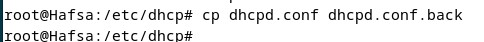
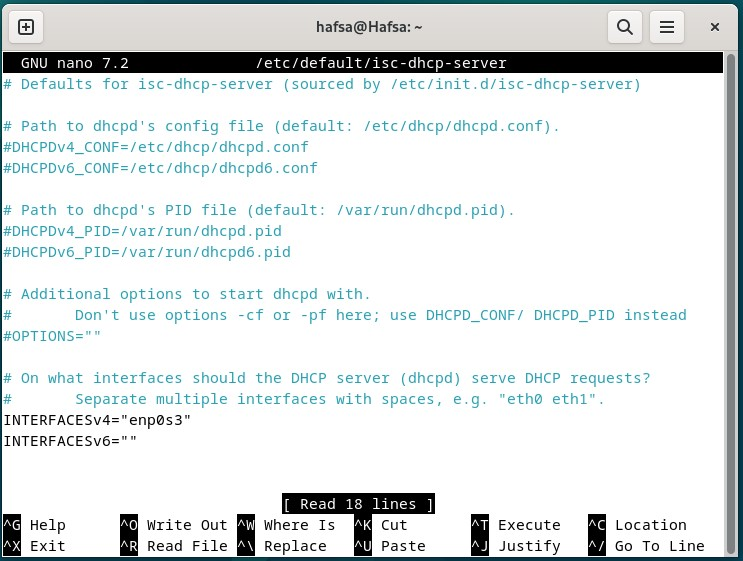

#  Actividad
### Realizando la instalación y configuración de un servidor DHCP en Debian, junto con la configuración de dos clientes, uno con Windows y otro con Ubuntu, en la misma subred. Configurando el servidor para que asigne automáticamente direcciones IP y parámetros de red a los clientes. Verificando que los clientes reciban correctamente la configuración y tengan conectividad con la red e Internet, y documentando todo el proceso y resultados obtenidos con las capturas necesarias:
--- 
## El diagrama :
   
   

 ## Preparación del entorno:
   
   ### Instalación :
   1. La máquina virtual del rooter Pfsence `Pfsense_Hafsa`:
   
   2. La máquina virtual del cliente Windows `W_Hafsa` :
   
   3. La máquina virtual del cliente Ubuntu `U_Hafsa`:
   
   4. La máquina virtual del servidor Debian `D_Hafsa`:
   
   ### configuración de la red
   
   > **Router**

   La máquina tiene dos tarjetas de red una conectada con internet usando Adaptador puente , la segunda conectada con red interna que se llama SRI215 para ser como puerta d'enlace para los clientes y el servidor para poder dar internet a las demás máquinas :
      Para la ip de la red LAN le damos: **10.0.215.1**, es **el gateway** con mascara de 24 bits, luego la interfaz wan la configuramos con DHCP :
   
   > **W_Hafsa**

   La maquina virtual de windows esta en la misma red interna SRI215, al principio le damos ip estatica: 10.0.215.7 , y como gateway la ip del router :
   

   > **D_Hafsa**

el servidor tambien esta en la misma red interna SRI215, deberiamos darle la ip estatica fija :10.0.215.2 :
   
   > **U_Hafsa**

   el cliente ubuntu tambien en la misma red interna SRI215, en el inicio le dimos la ip estatica: 10.0.215.9:

   
   > **Deshabilitar DHCP en el enrutador para que el servidor sea el único !**

   

### Comprobamos si el servidor Debian navega por internet

## Instalación del servidor DHCP en Debian

configuracion de dhcp:

copia de seguridad :

configuracion 1 dhcp :

copia de seguridad:

configuracion  rango start by 3 because the debian have the 2:

ubuntu reservacion :

dhcp configuracion restart :

dhcp satuts:

ex2 :

equipo windows as dhhcp :

. equipo ubuntu as dhcp :

gateway

nombre del dominio :

dns por defecto :

mac :

. windows :

ver el fichero rn debian :
cat /var/lib/dhcp/dhcpd.leases:

conection de ubuntu a windows :

de windows a ubuntu :

ping from ubuntu a internet :

ping from windows a internet :

ping from windows to the rooter:

ping from ubuntu to rooter :

ha registrado en los logs del sistema por la herramienta 
Journalctl:

sudo journalctl -u isc-dhcp-server --since "2024-10-10 12:00" --until "2024-10-10 13:00"

Preparación del entorno: Instalación y configuración de la red
Instalación del servidor DHCP en Debian
Configuración del servidor DHCP: Rango de IPs, puerta de enlace, DNS y reservas
Configuración de los clientes DHCP: Windows y Linux
Verificación de conectividad y acceso a internet en los equipos
Monitoreo de logs y actividad del servidor DHCP con journalctl
Documentación del proceso en GitHub y entrega en Teams

