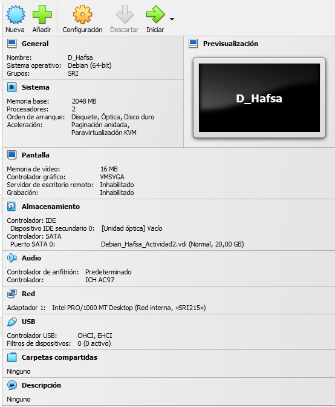

#  Actividad
### Realizando la instalación y configuración de un servidor DHCP en Debian, junto con la configuración de dos clientes, uno con Windows y otro con Ubuntu, en la misma subred. Configurando el servidor para que asigne automáticamente direcciones IP y parámetros de red a los clientes. Verificando que los clientes reciban correctamente la configuración y tengan conectividad con la red e Internet, y documentando todo el proceso y resultados obtenidos con las capturas necesarias:
--- 
1. ## El diagrama :
   
   

2. ## Instalación y configuración de la red. 
   1. ### la máquina virtual del rooter Pfsence:
   
   
   
   

   la red :
   
   
   
   
   dhcp no  en router :
   

debian navega por internet :

instalation of dhcp :

configuracion de dhcp:

copia de seguridad :

ex2 :

equipo windows as dhhcp :

equipo ubuntu as dhcp :

