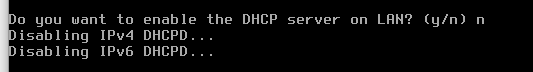

#  Configuración de un Servidor DHCP en Debian
---

   ## Introducción

En este documento se detallará el proceso para instalar y configurar un servidor DHCP en Debian, configurar los clientes Windows y Linux para que se conecten al servidor, y verificar la conectividad en una red local.

   ## Índice
- [Configuración de un Servidor DHCP en Debian](#configuración-de-un-servidor-dhcp-en-debian)
  - [Introducción](#introducción)
  - [Índice](#índice)
  - [Preparación del entorno de red](#preparación-del-entorno-de-red)
    - [El diagrama :](#el-diagrama-)
    - [Máquinas virtuales :](#máquinas-virtuales-)
  - 
    - [Configuración de la red :](#configuración-de-la-red-)
    - [Configuración del router :](#configuración-del-router-)
    - [Prueba de conexión a Internet :](#prueba-de-conexión-a-internet-)
  - [Configuración del servidor DHCP en Debian](#configuración-del-servidor-dhcp-en-debian)
    - [Instalación del servicio DHCP :](#instalación-del-servicio-dhcp-)
  - [Configuración del servidor](#configuración-del-servidor)
  - [Configuración de los clientes DHCP: Windows y Ubuntu](#configuración-de-los-clientes-dhcp-windows-y-ubuntu)
    - [Configuración de IP dinámica :](#configuración-de-ip-dinámica-)
      - [Windows](#windows)
      - [Ubuntu](#ubuntu)
    - [Verificación de parámetros asignados en los clientes :](#verificación-de-parámetros-asignados-en-los-clientes-)
      - [Windows](#windows-1)
      - [Ubuntu](#ubuntu-1)
      - [Verificación de Asignación de IPs en el Servidor DHCP :](#verificación-de-asignación-de-ips-en-el-servidor-dhcp-)
  - [Verificación de conectividad y acceso a internet en los equipos](#verificación-de-conectividad-y-acceso-a-internet-en-los-equipos)
    - [Conectividad entre los clientes:](#conectividad-entre-los-clientes)
    - [Acceco a internet:](#acceco-a-internet)
    - [Conectividad con el router :](#conectividad-con-el-router-)
  - [Monitoreo de Logs y Actividad del Servidor DHCP con journalctl](#monitoreo-de-logs-y-actividad-del-servidor-dhcp-con-journalctl)
  - [Conclusión](#conclusión)

---
---

## Preparación del entorno de red

   ### El diagrama :
   
   

   ---
   ### Máquinas virtuales :

   Creamos 4 máquinas virtuales en VirtualBox. Una para **Debian** como **servidor DHCP** y dos como **clientes**: una con **Windows** y otra con **Linux** .**Router Pfsense** . Luego conectamos todas a una **red interna llamada SRI215** :

1. La máquina virtual del **Rooter Pfsence** llamada *Pfsense_Hafsa*:

   
   
2. La máquina virtual del **Cliente Windows** llamada *W_Hafsa* :
   
   
   
3. La máquina virtual del **Cliente Ubuntu** llamada *U_Hafsa*:
   
   
   
4. La máquina virtual del **Servidor Debian** llamada *D_Hafsa*:
   
   
   ---
   
### Configuración de la red :
   
1.  **Router** :

      La máquina cuenta con **dos tarjetas de red**: una configurada como **adaptador puente** para conectarse a Internet, y la otra conectada a una **red interna llamada SRI215**, que actúa como **puerta de enlace** para los clientes y el servidor, permitiendo proporcionar acceso a Internet a las demás máquinas.

      En la red **LAN**, asignamos la dirección IP **10.0.215.1** como gateway, con una máscara de **24 bits**. Por otro lado, la interfaz WAN se configura utilizando DHCP:

      

2. **Debian Server**:
   
      El servidor también está en la misma **red interna SRI215**. Le asignamos una IP estática fija por ejemplo : **10.0.215.2** :

      
   
3. **El cliente Windows**:

      La máquina virtual con **Windows** está conectada a la misma **red interna SRI215**. Al principio, le asignamos una IP estática: **10.0.215.7**, y como **puerta de enlace**, usamos la dirección **IP del router**:

      

4. **El cliente Ubuntu:**

      El cliente Ubuntu también está en la misma **red interna SRI215**, donde le dimos la IP estática **10.0.215.9** al inicio:

      
   ---

### Configuración del router :

   En el router pfSense, **desactivamos el servicio DHCP** en la **red SRI215** para evitar conflictos con el servidor DHCP que configuramos en Debian:

   

   ---

### Prueba de conexión a Internet :

   Verificamos que el servidor Debian naviga por Internet :

   1. Ping a **8.8.8.8**:
   
      

   2. Ping a **www.google.es**:

      
---
---
## Configuración del servidor DHCP en Debian

### Instalación del servicio DHCP :

Instalamos el **servicio DHCP** en **Debian**, lo que nos permite asignar direcciones IP automáticamente en la red con el comando :`apt-get install isc-dhcp-server`:

---
---

## Configuración del servidor
   1. **Configuración de la Interfaz en el Fichero /etc/default/isc-dhcp-server**:
   
      En el fichero **/etc/default/isc-dhcp-server**, añadimos el nombre de la interfaz correspondiente, que en este caso es **enp0s3**. Para ello, configuramos la línea **INTERFACES='enp0s3'**, indicando así la interfaz de red que utilizará el servidor DHCP para asignar las direcciones IP :
   
      

   2. **Hacemos una copia de seguridad del fichero de la onfiguracion:**

      

   3. **Configuración del Rango de IPs y Parámetros DHCP en Debian para la Subred SRI215 en /etc/dhcp/dhcpd.conf** :

      En el fichero **/etc/dhcp/dhcpd.conf**, en el apartado que empieza con **"A slightly different configuration for an internal subnet"**, configuramos el **servidor DHCP** para la subred SRI215. Establecemos el rango de IPs de **10.0.215.3 a 10.0.215.100**, reservando **10.0.215.1** para el router y **10.0.215.2** para el servidor. La máscara de subred es **255.255.255.0**, la puerta de enlace es **10.0.215.1**, y el DNS es **8.8.8.8**. Además, el sufijo DNS es **SRI215.local**, y el tiempo de alquiler predeterminado es de **15 días**, con un máximo de **30 días** y un mínimo de **1 semana**:

      

   4. **Reserva de Dirección IP para el Cliente Ubuntu**:

      Realizamos la reserva de la dirección IP para el cliente Ubuntu, asignándole la IP **10.0.215.60**. De esta manera, garantizamos que el cliente siempre reciba la misma dirección IP al conectarse a la red.

      

   5. **Reinicio y Verificación del Servicio DHCP en Debian :**

      Reiniciamos el servicio DHCP para aplicar los cambios realizados en la configuración:

      

      Luego, verificamos que el servicio esté activo y en ejecución utilizando el comando systemctl status isc-dhcp-server, asegurándonos de que el servidor DHCP esté funcionando correctamente:

      

---
---

## Configuración de los clientes DHCP: Windows y Ubuntu

### Configuración de IP dinámica :

En los clientes Windows y Linux, ajustamos la configuración de red para que obtengan direcciones IP automáticamente desde el servidor DHCP. Esto se realiza configurando la opción de "Obtener una dirección IP automáticamente" en las propiedades de red de cada cliente:

   ---

#### Windows 

   ---

#### Ubuntu

   ---

### Verificación de parámetros asignados en los clientes :

Revisamos **las direcciones IP** y otros parámetros como **la máscara de subred, la puerta de enlace y los servidores DNS** para confirmar que coincidan con la configuración del servidor DHCP:

---

#### Windows 

En el cliente Windows, toda la configuración de red se verifica fácilmente utilizando el comando *IPCONFIG /ALL**. Este comando muestra información detallada sobre la dirección IP, la máscara de subred, la puerta de enlace y los servidores DNS:

---

#### Ubuntu

En Ubuntu, como cliente del servidor DHCP Debian, podemos observar varios parámetros importantes. La puerta de enlace predeterminada es **10.0.215.1** (como se muestra en la imagen):

El nombre de dominio está configurado como **SRI215.local**:

El DNS predeterminado viene configurado por defecto en Ubuntu. Este valor puede modificarse editando el archivo **/etc/resolv.conf**:

También podemos verificar la dirección **MAC** del cliente:

**Estos detalles confirman que la configuración de red está correctamente aplicada desde el servidor DHCP.**

---

#### Verificación de Asignación de IPs en el Servidor DHCP :

Comprobamos que las IPs han sido asignadas correctamente dentro del servidor DHCP utilizando el comando **cat /var/lib/dhcp/dhcpd.leases** :

---
---

## Verificación de conectividad y acceso a internet en los equipos

### Conectividad entre los clientes:
   1. De Ubuntu a Windows :

      

   2. De windows a Ubuntu :

      

      ---

### Acceco a internet:

   1. Ubuntu:

      

   2. Windows :
   
      

      ---

### Conectividad con el router :

   1. Windows:
   
      

   2. Ubuntu :

      

---
---
      

## Monitoreo de Logs y Actividad del Servidor DHCP con journalctl

El servidor DHCP en Debian, utilizando **isc-dhcp-server**, gestiona automáticamente las direcciones IP a través de un ciclo de cuatro fases: **descubrimiento, oferta, solicitud y confirmación**. Durante este proceso, el servidor asigna **direcciones IP, máscara de subred, puerta de enlace y servidores DNS** a los clientes, además de gestionar las renovaciones de leases. Toda esta actividad se registra en los logs del sistema, lo que permite una supervisión detallada del servicio. Mediante el uso de **journalctl (journalctl -u isc-dhcp-server)**, podemos monitorizar en tiempo real las solicitudes, asignaciones y posibles errores, garantizando así que el servidor DHCP funcione correctamente y que las configuraciones de red se apliquen sin inconvenientes.

Para **filtrar los logs por un período específico**, podemos ejecutar el siguiente comando en el servidor:

`sudo journalctl -u isc-dhcp-server --since "2024-10-10 12:00" --until "2024-10-10 13:00"`

---
---

## Conclusión 

La configuración de un servidor DHCP permite gestionar de manera automática y eficiente las direcciones IP en una red, facilitando la conectividad de los dispositivos. Completar estos pasos garantiza que el servidor y los clientes funcionen correctamente en una red local.
